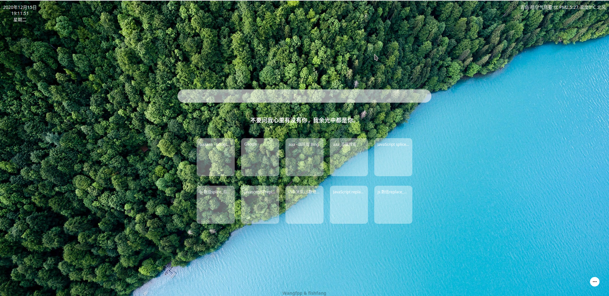

### 开发一个自己的Chrome主题工具

### 使用方法

- clone此项目到本地

- 注册自己的天气appid 这个是免费的
[天气API](http://www.tianqiapi.com/index)

- 打开js/weather.js替换appid和appsecret

-  Chrome设置 加载已解压的扩展程序

### 预设功能列表

- light-dark主题切换功能

- 当前日期和天气显示

- 自主切换背景

- 设置搜索引擎

### 贡献者

### 效果图

### 参考文档
[中文文档](https://wizardforcel.gitbooks.io/chrome-doc/content/1.html)
